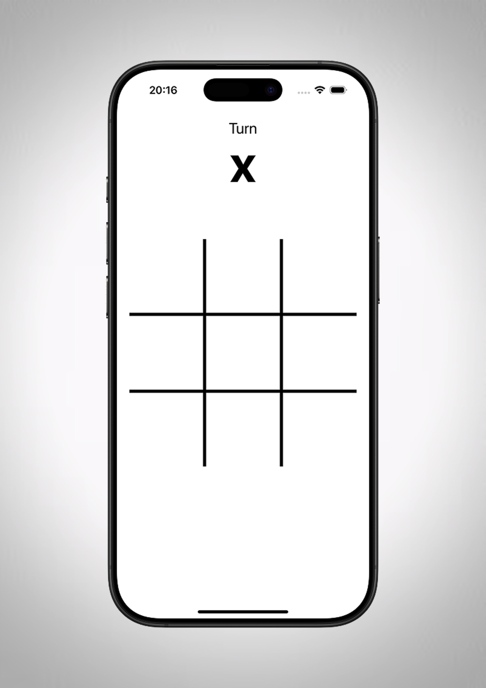
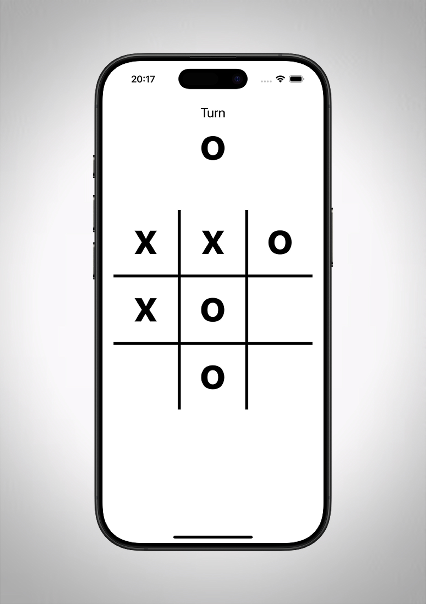
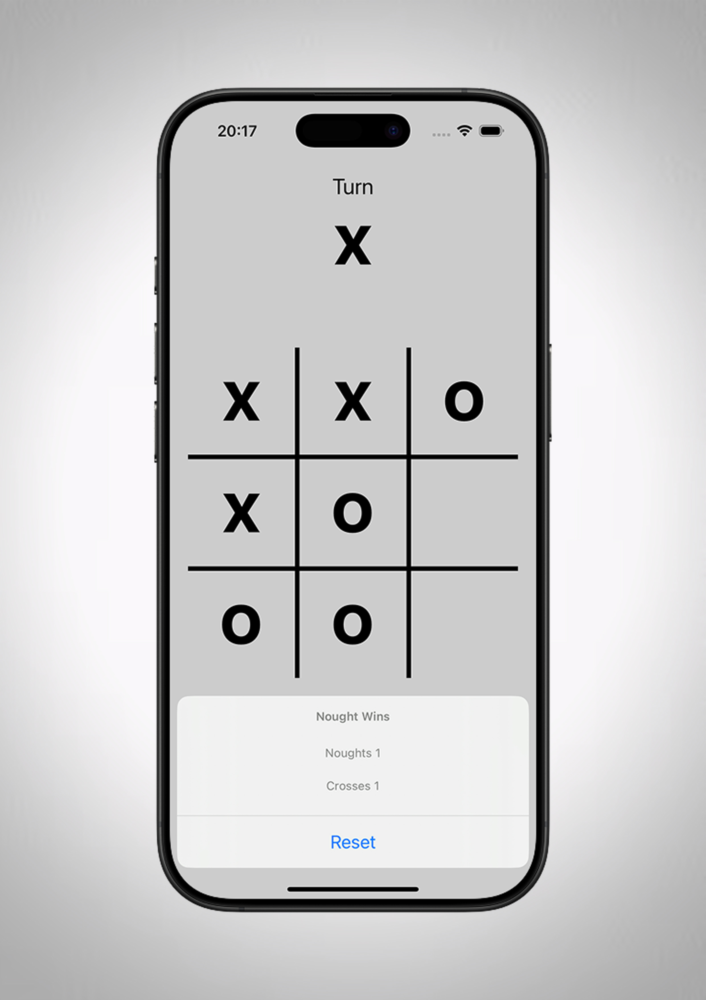

# ❌ **Tic Tac Toe** ⭕
Mon premier projet est un jeu classique de Tic Tac Toe, développé avec UIKit. Ce projet m'a permis d'explorer les bases du développement d'interfaces graphiques sur iOS et de gérer les interactions utilisateurs.

 

    
    
    

 

**Technologies utilisées :**
- 🖥️ UIKit
- 🐦 Swift

**Fonctionnalités :**
- ✖️ Affichage dynamique du joueur en cours (X ou O)
- 📝 Gestion des scores
- 🔁 Réinitialisation de la partie
